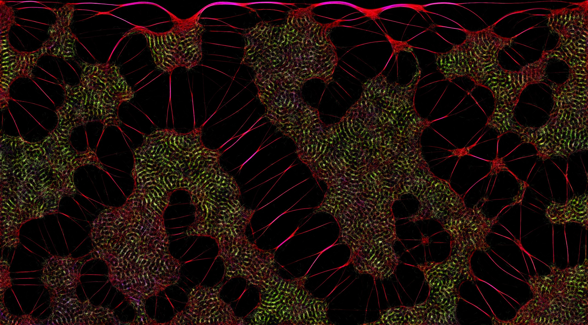
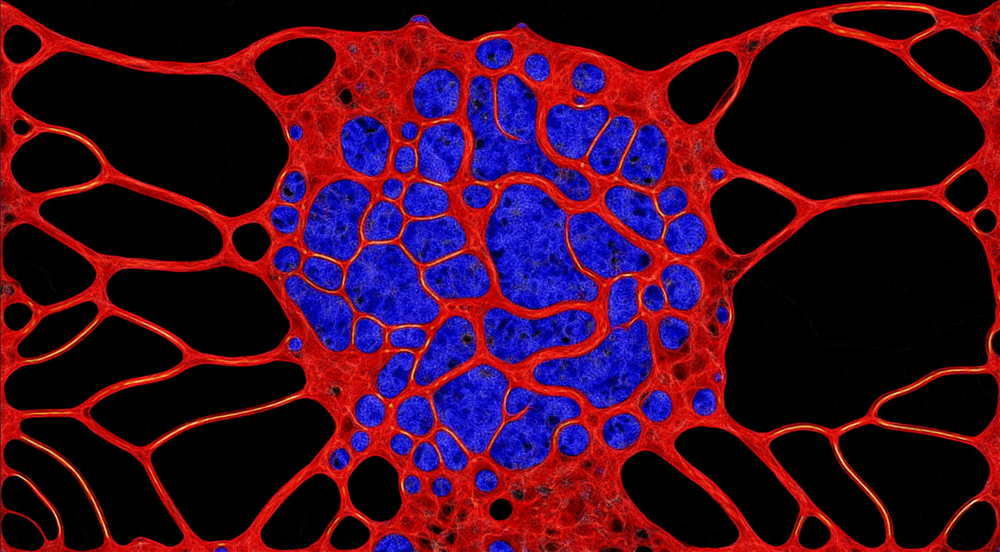
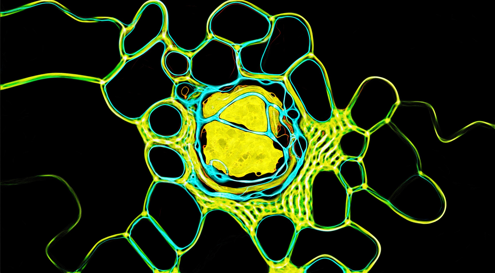
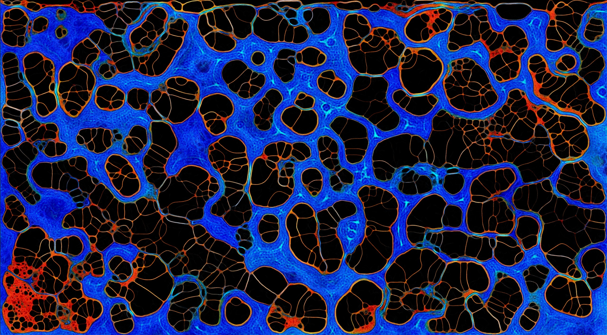

# Slime Simulation

Slime Simulation is a project I developed in my custom engine ([Boot Engine](https://github.com/bootzin/BootEngine)) that simulates the behaviour of a slime mold, forming beautiful 'organic' patterns.

## How does it work?

The code itself is very simple. Each particle is simulated individually following rules that define how will it move. Whenever a particle moves, it leaves behind a trail that both dissipates and evaporates over time, and the color of the trail represents which species that particle belongs to. 
The particles tend to move towards the trail of the same specie, and avoid the trail of the others. Different species also behave differently, varying in speed and sensor configuration.
In order to allow for so many particles at once, compute shaders were used to draw into a texture that's rendered to the screen

## Usage

You may download the repo and compile the code yourself or download the zip from the release. For now, only 64bit Windows is supported. DirectX is required.
When launching the application, you can specify both the width and height of the window in the command line, otherwise it will lauch with default settings (2560x1440).

After the application has launched, you can tweak various settings to your preference. These settings are adjusted on two GUI windows called 'Control Panel' and 'Simulation Settings'. These windows can be dragged outside of the main window, to allow for better visualization of the simulation. Also keep in mind that the code currently does not support resizing the main window.

The following settings are available for customization:

- Number of agents (particles)
- Number of species
- Type of spawn when generating particles
- Force white color*
- Reduce saturation**
- Pause simulation
- Steps per frame
- Auto adjust steps per frame***
- Max speed
- Max turn speed
- Preserve species
- Trail weight
- Decay rate
- Diffuse rate
- Per species movement speed
- Per species turn speed
- Per species sensor size
- Per species sensor distance
- Per species sensor angle

 \* Makes all species have the white color. As the trail tracking is done in the shader, the color is used to decide wether two particles are from the same species or not. With this option enabled, different species would follow their trails as if they were the same.
** Sometimes, when particles cross with another species trail, the added color saturates and becomes white. To avoid this, this option desaturates their colors. It is enabled by default.
**\* Steps per frame adjust how fast the simulation runs. It also affects how fast the trail evaporates. I recommend setting its value as high as possible, and then adjusting diffuse/decay rates, as well as trail weight. The option to auto-determine this will adjust its value depending on FPS. Keep in mind that since the simulation start at 100,000 agents it may be taxing on low end computers even at 1 step per frame. In that case, reduce the resolution and adjust the amount of agents to what best suits you.

## Pictures

Here are some examples that I managed to achieve. Please feel free to open a github issue to post pictures of what you've got!

  
   
  
  

## License
[MIT](https://choosealicense.com/licenses/mit/)
